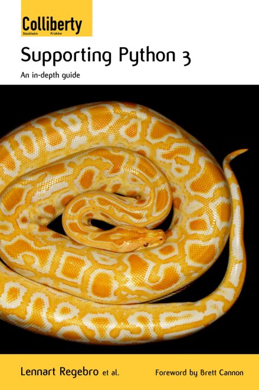

:css: css/stylesheet.css
:skip-help: true
:title: Prehistoric Patterns in Python
:auto-console: false

.. footer::

    .. image:: images/BriteCoreLogo.jpg

----

You Are a Good Programmer
=========================

.. class:: name

    Lennart Regebro

BriteCore tech talk

2019-05-16

.. note::

    My name is very hard to pronounce.
    In fact, almost every time somebody asks how my last name is pronounced,
    I get self conscious and mispronounce it.

    So just call me Leonard.

----

.. note::

    I bought my first computer when I was around 15, in 1981 or 1982 or so.
    You can see it was designed in the 70's, because it's brown and orange.
    But this bad boy sported a 4MHz Z80 and innovative byte compiled basic.
    Oh yeah, it was fast!
    The graphics did leave something to be desired, though,
    it was 78 * 72 pixels in monochrome.

----

.. note::

    So the games were generally not very good,
    which meant that to have fun with this computer you had to program it.
    So I did.

    And when it was time for me to decide what to do in life, I took the easy path.
    I clearly had a knack for computers, so I got a job as "computer guy".
    I then went on to do technical support, and then sales support.
    In 1996 a friend gave me a job as a programmer!
    In 1999 another friend told me about Zope and Python,
    and I started making websites in Python.
    By 2001 I was a fulltime Python web developer, and after many complications,
    here I am at BriteCore!

----

.. note::

    I've written a book,
    and I've done a lot of talks on conferences around the world.
    I've also written a lot of open source modules.

    This has gotten me some name recognition,
    and some people here therefore already know who I am.

----

Fame != programming skill
=========================

.. note::

    So you may have heard my name, but that doesn't mean I'm a good programmer.
    I hope I am a good programmer, but it's probably not for the reasons you might think.

    And that's what this talk is about: What makes a good programmer.

----

.. image:: images/hackerman.jpg
    :width: 100%

.. note::

    We all know, that the way programmers are depicted in movies isn't true.

----

.. note::

    We don't type super fast, and programming is not done in 3D virtual environments.

----

.. note::

    And we definitely do not spend our time trying to hack into computers that
    will beep loudly and display big flashing "HACKING DETECTED" signs if we fail.

    Being a good programmer is not something that can be shown in a movie,
    so Hollywood's conception is wrong.

    But what they get wrong is not just how programming happens,
    but it also portrays an inaccurate view of programmers.

----

Media myth: Programmers are weird socially inept Wizards
========================================================

.. note::

    This is Dennys Nedry from Jurassic Park. He is rude, overweight,
    a computer wiz and a greedy coward. Not a great portrayal.

    Computer savvy people are almost always shown as weird, socially inept and male.
    This portrayal does have some basis in reality.

    The archetypal computer nerd, the person who made computers not just a job, but a life,
    that person showed up in the 70's and it was a he, and he was indeed somewhat socially inept.
    He also didn't care much about clothes, and tended to look like a slob.

    That's probably the source of the myth that programmers have bad personal hygiene.

----

Our myth: Programmers are weird smelly Wizards
==============================================

.. note::

    But nerds took this image, and embraced it.
    It became a badge of honor to not care about anything but computers.
    And for some people, that even included personal hygiene,
    and hence the myth of the smelly programmer became a self-fulfilling prophecy.

    But that was the 70's and 80's, when computers were weird and incomprehensible.
    Since the Internet happened, computers became cool.

----

.. note::

    The ultimate evidence of that was that sometime in the 2000's hipsters started adopting nerd fashion.
    And today, programmers are perfectly normal people.

    But if we take away the smells and social ineptitude from the typical programmer cliche,
    all we get is a nerdy wizard.
    And that image is something programmers hold near and dear.

----

The Story of Mel
================

.. note::

    Amongst the famous programmer folklore is a story called "The Story of Mel".
    It tells the perhaps true story of a programmer who wrote a program
    to play blackjack used by the computer company to demonstrate the computer for customers.
    He is portrayed as a hero for two reasons.
    1. He refused to change the program to let potential customers win.
    2. He wrote code that was extremely efficient and fast,
    but was so complicated that nobody else was able to modify it.

----

Myth: Real Programmers Write Machine Code
=========================================

.. note::

    Was Mel a good programmer? No. He was clever. Clearly he was very smart.
    He knew the computer inside out.

    But he wrote hand optimized assembler code that other people could not easily modify.
    That makes him a very good programmer as long as he doesn't have to work with others.
    But if he doesn't work with others, then when he quits, his code is dead.

----

Wizards make bad programmers
============================

.. note::

    All sufficiently advanced technology is indistinguishable from magic.
    And all sufficiently obtuse code is indistinguishable from wizardry.

----

.. note::

    What does this code do?
    It's nearly impossible to figure out.
    It's a chess program, and one of the winners of the
    International Obfuscated C Coding Contest that happens every year.

    It's fun, but again, it plays into the wizard stereotype.
    If you wrote code like that for work, you'd make the boss very unhappy.

----

.. note::

    But the myth perpetuates, the Stackoverflow is full of people asking how to
    do things in one line in Python.
    That's not a useful question.
    Only do it in one line if it becomes more readable in one line.

----

.. note::

    So, now that we have crushed the normal stereotype of what a good programmer is,
    and we have this blank slate, what is a good programmer, really?

----

Code is communication
=====================

.. note::

    Computers only do maths and shuffle bits around.
    There are infinite ways to make a computer take a certain input and create a certain output.

    The code we choose to use should mainly and most importantly tell other programmers what it does.
    That's why Python is such a great programming language, it's readable.

----

.. code:: Python

    labels = ['X is not 3', 'X is 3']
    print(labels[X==3])

.. note::

    This works. It's not particularly readable.
    Yes, I have encountered code like this.
    Yes, it was written by a wizard, which shall remain nameless.

----

.. code:: Python

    print(['X is not 3', 'X is 3'][X==3])

.. note::

    We can even make it a Stackoverflow oneliner.

----

.. code:: Python

    print('X is 3' if X==3 else 'X is not 3')

.. note::

    There is even a pythonic way of doing this now,
    but that didn't exist when the above code was written.

----

.. code:: Python

    if X==3:
        print('X is 3')
    else:
        print('X is not 3')

.. note::

    I would definitely prefer this

----

Good programmers
================
write readable code
===================

Use descriptive names

Write the code the obvious way

If there is no obvious way, explain with a comment

.. note::

    Write readable code.
    Not just for others, but also for yourself.

----

Good programmers
================
write comments and tests
========================

.. note::

    The same above wizard would, when code changes was suggested to some
    particularly obtuse bit of code explain why that code looked like that
    by referring to what bug he fixed with that line of code 8 years ago.

    Personally, I will have forgotten why the code I wrote looks like it does in a few months.

    This means I have to write comments, or I won't be able to fix my own code.
    Also, to make sure I don't accidentally reintroduce bugs, I need to have tests.

----

Good programmers
================
knows their tools
=================

.. note::

    Good programmers know their tools.
    Here we have yet another benefit of Python, it's not a huge language.
    But that said, there are a lot of quirks and internals that you might trip on anyway.

----

.. note::

    I recommend Fluent Python by Luciano Ramalho as a book for any Python programmer
    that has gone above newbie level.
    It's extremely detailed, it's a big book, and contains a lot of good information.

----

Good programmers
================
know when to use that knowledge
===============================

.. note::

    The benefit of knowing your tools well is that you don't get into
    trouble by doing something that works most of the time, but not always.

    The drawback of knowing your tools is that you might get tempted to be
    wizard-level clever when you don't need to.

    But sometimes you do need to.
    And sometimes that comes back and bites you anyway.

----

zope.interface
==============

.. code:: Python

    >>> import zope.interface
    >>> class IFoo(zope.interfaces.interface):
    ...     # Define methods etc here

    >>> class Foo:
    ...
    ...     zope.interface.implements(IFoo)
    ...
    ...     # Implement the methods here

.. note::

    Some 15 years ago, Jim Fulton,
    the main developer behind the groundbreaking webframework Zope,
    wanted some sort of Java-like interfaces in Python.
    He wrote the zope.interfaces module for that.

    If you think it looks like abstract baseclasses, you are right,
    although it does more than ABC's, but the ideas are similar.

    But look at that line that goes zope.interface.implements(IFoo)
    That's a function call, in the body of a class definition!
    What does that do!?

----

.. code:: Python

    caller_locals['__metaclass__'] = advise

.. note::

    It is a couple of function calls in, but in the end, it adds a metaclass variable
    to the locals of the class body.

    In other words, that function will dynamically create a metaclass and insert that
    in the class definition, so that when the class in finally created, it will get a
    special metaclass created in runtime.

    Why did he do this?

----

Good programmers
================
don't use clever hacks
======================

Unless they have to

.. note::

    Easy: Because he had to. There was no class decorators in Python 2.3,
    they didn't arrive until Python 2.6, which is at least 6 years after Jim Fulton
    wanted interfaces.
    The alternative would be to create a new Metaclass for each class where you wanted
    an interface, and then use that. Nobody would have wanted to use it.

----

The Python bites back
=====================

Python 2:

.. code:: Python

    class Foo(object):
        __metaclass__ = bar

Python 3:

.. code:: Python

    class Foo(object, metaclass=bar):
        pass

.. note::

    Of course, in Python 3, metaclasses aren't defined with class body statements,
    so the zope.interface code doesn't work anymore.
    But since we have class decorators now, zope.interface was just extended to support
    that as well. It meant someone had to write 2to3 fixers to enable automatic conversion
    of Python 2 code to Python 3, and that turned out to be me,
    and that was a pain. So maybe it didn't bite Jim, it bit me.

----

Good programmers
================
document their libraries
========================

.. note::

    But the reason it was a pain to write those fixers is that
    it's not actually documented anywhere how to write 2to3 fixers.

    And this is probably a wizards fault again.
    Guido van Rossum is clearly a very smart person.
    At PyCon sprint in Atlanta he ended up sitting at the same table as me.
    And people came to him with quite complicated problems, to which he would answer
    "Hmm. Have you tried X?" and people went "uh, no, hmm, actually that might work, thanks!"
    Wizard level stuff going on there clearly.

----

Use the Source, Luke
====================

.. note::

    But it is also my understanding that he wrote the 2to3 library,
    and what you see here is the full extent of that libraries documentation.

    Reading the source code helped, but I'm pretty sure it would have been faster
    if there had been documentation.

    Luckily, most changes either has a fixer already, or you can do it with
    a regexp search and replace, so you will never have to write a fixer.

----

Communication skills
====================

.. note::

    One thing programmers are notoriously bad at is communicating.
    Not just with non-programmers, but with programmers as well.
    We tend to be very short, and that can be interpreted as rude,
    especially when internet is in the way.

----

Soft language
=============

.. note::

    Instead of in a code review saying "Don't use tabs", say
    "looks like you got tabs in there by mistake".

----

.. note::

    Anecdote time: In the late 1990's I worked for a telecom company on their
    billing department.
    Their billing office had very high employee turnover,
    in other words, people didn't stay long. A few months generally.
    Their solution to that was to always be two people when you did anything.
    Correcting invoices, making reports fixing things up that was wrong,
    changing the billing etc.

    Every time a new person started, somebody more experienced would sit with them and work.
    That's how they taught new people. You sat behind them, and watched them do the job.

----

.. note::

    Once they could do the simple things, they did those by themselves,
    but as soon as they did something difficult, somebody else moved their
    chair over. If it was REALLY difficult, the current billing team boss,
    with a few years of experience, would be the one who sat down,
    often without knowing how to do it, but with years of understanding the system,
    and they worked it out together, and then both know how to do it.

    I thought that was pretty clever.

----

.. note::

    Well, a few years later on my next job, I read this book. And one of the things you do
    in Extreme Programming is of course pair program. Exactly the same
    type of knowledge Sharing I had seen at my previous job.
    I thought it was brilliant, and I still do.

----

Good programmers
================
share their knowledge
=====================

Pair programming

Tech talks

User groups

Conferences

Hackdays/Sprints

.. note::

    Sharing knowledge is absolutely crucial for success,
    both in a project, and in a career.
    And you should share knowledge in all ways you can.

----

Pair programming
================

.. note::

    Pair programming is probably the most efficient way of getting new information.
    You learn much more and much faster by pair programming,
    and it can be bidirectional, you can both learn.

    It's hard to do when we all work remote though.

----

Tech talks
==========

.. note::

    If you have experience with a certain tool or area, talk about it.
    Not just in BriteCore, but get out there.

----

User groups / Conferences
=========================

.. note::

    Talk on your local user groups or bigger conferences.
    And go there and listen as well.
    Also meet people. Party with them.
    The IS industry drinks a lot of alcohol, but one of the good things
    with programmer culture is that it has always been very accepting.

    If you don't drink alcohol, there usually isn't a lot of pressure to do so.
    Exceptions happen of course, please ignore them.
    PyCon US is also very family friendly now, people bring their kids.
    It's awesome.

----

Hackdays / Sprints
==================

.. note::

    Conferences often have sprints associated with them,
    and some groups organize sprints or hackdays separately.
    Those are generally fun, and is a good opportunity to pair program with
    people you don't know, hence spreading knowledge!

----

Good programmers
================
network
=======

.. note::

    And conferences, user groups, sprints etc are good opportunities to network.
    Not only is that good for your career, it again gives you more opportunities to learn and to teach.
    And, if you meet someone who seems like a good programmer, you can recruit them to BriteCore.
    So it's good for everyone!

    And please to submit talks to the conferences you go to.
    Not only are you sharing knowledge, you advertise yourself, and BriteCore!

    If it scares you, see above: Team up with someone.
    Write a talk together with a person, and present it together!
    Pair conferencing!

----

Good programmers
================
learn from mistakes
===================

.. note::

    This is pretty obvious, but I'll mention it any way.
    More anecdote time here:

----

.. note::

    I once worked on the Windows user interface for a system that
    monitored the levels of big storage tanks of petroleum products.
    It looked at the usage to tell our client,
    which produced these products,
    that the tank needed filling up.
    It enabled them to send trucks with new product before the customer even knew they needed it.

    Working with client on this was funny.
    They would ask "Is it possible to change the label in the UI here?
    You don't need do it if it's a lot of trouble!"
    And then one day at the end of a meeting they said
    "Oh, and we need to redo this to be a client-server, that should be easy!"

    Well... making software that runs on one computer into
    a client server system is usually NOT easy.
    But they didn't know that.
    So they assumed it was easy.

----

.. note::

    Well we had been smart, we used Borland Delphi.

    On a previous job I had as a computer admin,
    the programmers on the system this company was developing decided
    to support multiple servers by putting the database on a network drive.
    But that database was not designed for that, and it caused a lot of problems.

    So one of the reasons we choose Borland Delphi for this system was
    that it had really nice integration with dBase,
    which we knew was a stable database that **could** be shared by multiple
    clients on a network drive.

----

.. note::

    We choose a database we knew could do things that we *might* need.

    Today, of course, you would use some SQL database, but back then,
    that would mean putting up a separate Oracle server,
    so that wasn't an option. But Delphi and dBase did the the job.

    I took the functions that communicated with the boxes
    you saw previously, and I made that into it's own program
    that would run on a separate computer, that we put into the server room,
    and everyone in the company could then
    open the client software and see the customer status.

----

.. image:: images/progammer-hero-woman.jpg
    :width: 100%

.. note::

    So heroically we made this software client-server!
    It took less than a week to make it client server.

    And the real hero here is the shared experience of the three of us
    that worked in that company then.
    And that's another thing that makes a good programmer.
    Experience with both good and bad solutions.
    And that just comes with time.

    Being a super smart wizard won't make you a good programmer.
    You also don't need to eat and breathe computers day and night.
    You can do that, certainly, especially while you are studying.

----

.. note::

    Seeing others fail is not the only way to learn either.

    One thing that has helped me is that I have worked in all parts of the IT industry.
    I've even worked half a year trying to sell computers. That did not go well.
    I also taught computers to kids in a school for a few months. That did go well.

    So I have seen and helped people that use software,
    I've been the guy that installs software,
    and I've worked with people who sell software.
    These perspectives helps me understand where everyone else comes from.

----

.. image:: images/confused-computer.jpg
    :width: 100%

.. note::

    Although I can still laugh at people being stupid about computers,
    I realize that usability is good thing,
    and that if a customer says something is hard to use they aren't being stupid.

    I don't get angry that the requirements from sales shift every day.
    Customers don't know what they need until the moment they need it.
    And that's OK.

----

.. note::

    Now if you think all that sounds easy, for some people it may be.
    And for others it might not.

----

Psychological syndromes
=======================

.. note::

    There are several mistakes we do in evaluating ourselves.
    These mistakes typically have fun names with "Syndrome"
    after them, making them sounds like some sort of illness,
    but they are not, they are just mistakes.

----

"Smartest person in the room" syndrome
======================================

.. note::

    A lot of programmers have grown up being smarter and more logical
    than most people in their class, and sometimes even in their family.

    That often leads to them thinking they are the smartest person ever.
    This in turn means they don't listen to others.

    Don't fall into that trap.

----

.. note::

    Other symptoms of this is that you can just make a guess and
    present that to the world as if it is fact, because you are
    used to being able to bullshit your way through conversations.
    That works, until you find somebody who actually know what they
    are talking about, and you end up looking very silly.

    If you guess, say that you are guessing.
    We already know that you are smart,
    we also know that you don't know everything, so don't pretend.

----

Dunning-Kruger syndrome
=======================

.. note::

    A related topic to smartest guy in the room is the
    Dunning-Kruger syndrome or Dunning-Kruger effect,
    named after to psychologists.

    This is the tendency of people to overestimate how much
    they know of a topic, and underestimate how hard it is.
    We all do that.
    I used to watch the TV Show Kitchen Nightmares with Gordon Ramsay.
    It was full of people who started a restaurant with no experience.
    They thought it was easy, right? Looks easy if you are a customer.
    It's not easy.

----

.. note::

    If we combine Dunning-Kruger with stupdity we get astonishing results,
    like creationists anti-vaccers and flat earthers.

    Flat earthers will happily claim that they can prove that the earth is flat,
    and then quickly prove that they can't even do basic maths.

    And that's why all these groups don't believe in science: They don't understand it.
    None of you here are in any significant risk of getting Dunning-Kruger
    THAT badly though.

    And we mostly end up doing the opposite of Dunning-Kruger

----

Bikeshedding
============

.. note::

    We tend to do bikeshedding.
    Bikeshedding is when a topic that we know we don't know is discussed,
    and suddenly, a subpart of the problem is something we DO understand.
    Then we dive headlong in that discussion, and it can take over the whole debate,
    even if it's not actually important.

    The name comes from the example of people being in a meeting about building a nuclear reactor.
    Most of the people in the meeting doesn't know much,
    until the question about what color the power plants bike shed should be.
    Then EVERYONE has an opinion.

    Don't get stuck discussing things that aren't important.

----

Impostor Syndrome
=================

.. note::

    The bigger version of that is "Impostor Syndrome".
    It's the feeling that you have no idea what you are doing,
    which means you end up not even saying anything about the bikeshed.

    In bad cases this can lead to you feeling inadequate,
    and lead to depression.

----

Rejection doesn't mean you are bad
==================================

.. note::

    You will, for example, encounter having pull requests denied,
    or people saying that it's not good.
    Don't take it personally.
    And remember, if they seem rude,
    it's just the internet that's in the way again.

    You might go to a big python conference and be surrounded by Guru's
    but they also generally had no idea what they were doing when they did it.
    If you know what you are doing, then you aren't learning and growing.

----

Nobody knows everything
=======================

It's OK to not know

It's OK to guess

It's OK to ask questions

.. note::

    You are not expected to know everything, especially not from the start.
    You are not expected to be self-sufficient.

    It's OK to not know, it's OK to guess. But if you are making an educated guess,
    say that. Don't just state it as a fact.

----

Good programmers
================
ask questions
=============

.. note::

    If you don't know, ask someone.
    Also, learn how to ask good questions.

    I once encountered the question on Stackoverflow
    "How do I write a login page in the Plone content management system".
    Well, Plone already has a login page, you don't need to write one.
    The response to that information was "I need to write a login page in Plone".

    You see the problem here. They didn't give any information.
    It took me several days, maybe even a week, to figure out that
    the manager of the company had asked them to write a login page for Plone.
    So they had to. Because their boss told them.

    They asked questions, and that's good.

----

.. note::

    But a good programmer also steps up and says "No, wait, this makes no sense"
    even to his or her boss.

----

.. note::

    Programmer culture is luckily very tolerant, we accept weirdoes of all types.
    Before I went to PyCon I have only ever encountered and talked to one transgender person
    in my whole life. On a typical PyCon there are several.

    In the programming community minorities are generally welcomed.
    But that doesn't mean that racism, sexism and homophobia doesn't exist.
    It does. Try not to let it get you down if you encounter it.

----

Good programmers
================
are welcoming and tolerant
==========================

.. note::

    Most people in the community are not racist or sexist.
    And if you do encounter it, tell someone.
    If it's not aimed at you, tell the person doing it.
    Stand up and say "That's not OK!"

----

Thanks!
=======
